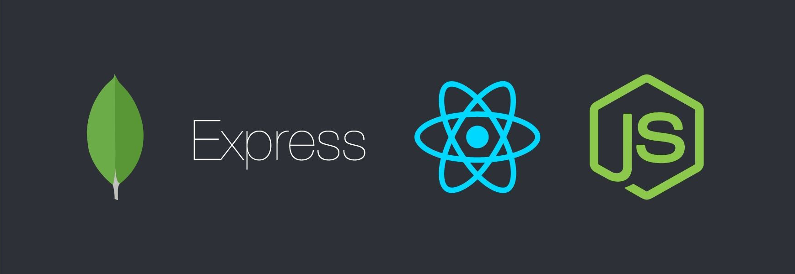

<h1 align="center">Hi 👋, I'm Gautam Vaishnav</h1>
<h3 align="center">A passionate Fullstack web developer.</h3>

  

  

- 🔭 I’m currently working as a intern at [Kainskep it](https://kainskep.com/)

- 🌱 I’m currently learning about **ELK stack**

- 👨‍💻 All of my projects are available at [https://gautamvaishnav.netlify.app/](https://gautamvaishnav.live/)

- 📫 How to reach me **gauravvaishnav8690@gmail.com**

<h3 align="left">Connect with me:</h3>

   

   
   
      
   
   

<table><tr><td valign="top" width="33%">

### Frontend

</td><td valign="top" width="33%">

### Backend

</td><td valign="top" width="33%">

### Tools and libraries

</td></tr></table>

### Platforms where I host my projects for showcase

   

&nbsp;
   

